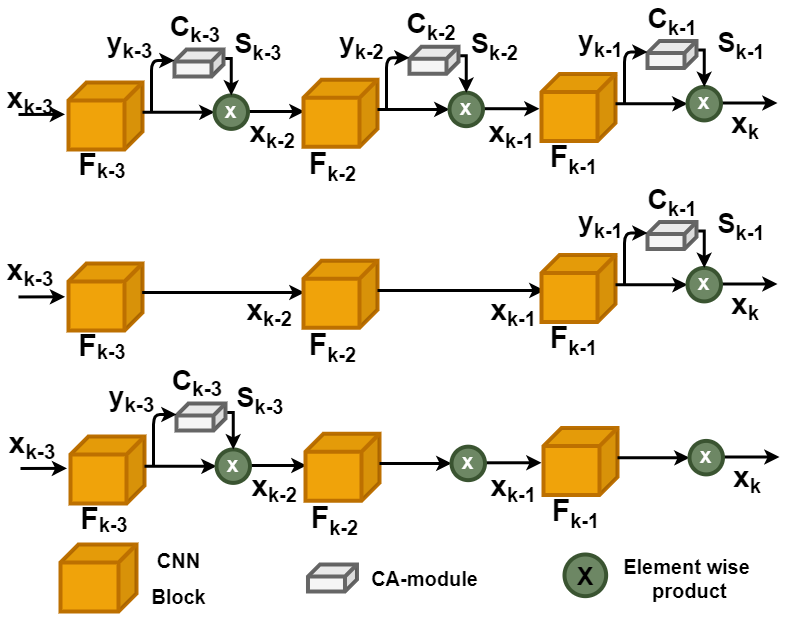
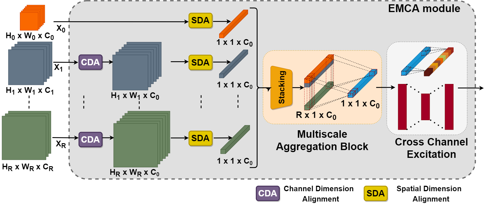
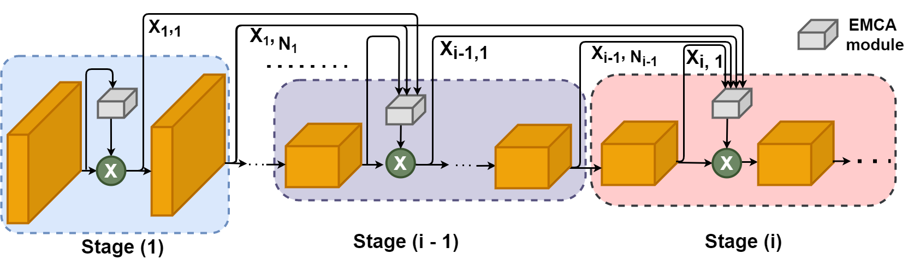
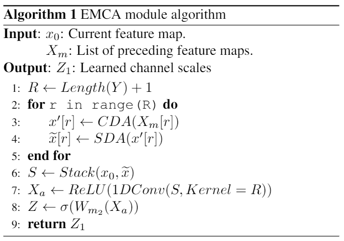

# EMCA
This is an original Pytorch Implementation for our paper "EMCA: Efficient Multi-Scale Channel Attention Module"
## 1- Abstract:
Attention  mechanisms  have  been  explored  with  CNNs,both across the spatial and channel dimensions.  However,all the existing methods devote the attention modules to cap-ture local interactions from a uni-scale.  This paper tacklesthe following question: Can one consolidate multi-scale ag-gregation while learning channel attention more efficiently?To  this  end,  we  avail  channel-wise  attention  over  multi-ple feature scales, which empirically shows its aptitude toreplace the limited local and uni-scale attention modules.EMCA is lightweight and can efficiently model the globalcontext further it is easily integrated into any feed-forwardCNN architectures and trained in an end-to-end fashion. Wevalidate our novel architecture through comprehensive ex-periments on image classification, object detection and in-stance segmentation with different backbones.  Our experi-ments show consistent gains in performances against theircounterparts, where our proposed module, named EMCA,outperforms other channel attention techniques in accuracyand  latency  trade-off.   We  also  conduct  experiments  thatprobe the robustness of the learned representations.

## 2- Motivation:
### 2.1- Avoid Dense Integration Intuation:

### 2.2- Avoid Dense Integration Results:
|Method|Model|FPS|#.P (M)|Top-1(%)|Top-5(%)|Weights|FPS|#.P (M)|Top-1(%)|Top-5(%)|Weights|FPS|#.P (M)|Top-1(%)|Top-5(%)|Weights|
|:----:|:---:|:-:|:-----:|:------:|:------:|:-----:|:-:|:-----:|:------:|:------:|:-----:|:-:|:-----:|:------:|:------:|:-----:|
|      |     |                  *SE*               |||||                  *ECA*              |||||                  *SRM*             |||||
| ALL   | R-18|187|  11.231 | 70.59  | 89.78 | xx|  192  | 11.148 |  70.75 | 89.74  | xx| 154 | 11.152 | 70.96 | 89.81|xx|

## 2- EMCA Architecture:
### 2.-1- Multi-Scale Inocrporation

### 2.2- Integrating EMCA Module:

### 2.3- EMCA Algorithm:

# Citation
