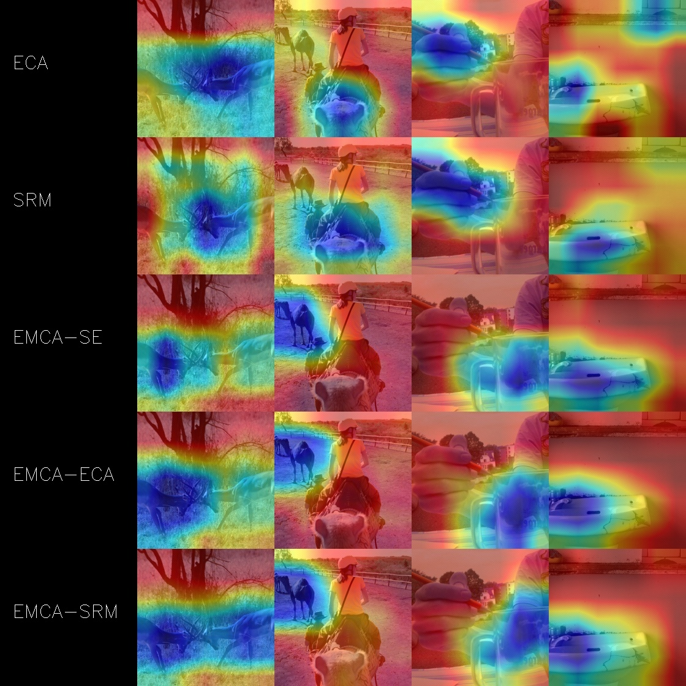

# EMCA
This is an original Pytorch Implementation for our paper "EMCA: Efficient Multi-Scale Channel Attention Module"
## 1- Abstract:
Attention  mechanisms  have  been  explored  with  CNNs,both across the spatial and channel dimensions.  However,all the existing methods devote the attention modules to cap-ture local interactions from a uni-scale.  This paper tacklesthe following question: Can one consolidate multi-scale ag-gregation while learning channel attention more efficiently?To  this  end,  we  avail  channel-wise  attention  over  multi-ple feature scales, which empirically shows its aptitude toreplace the limited local and uni-scale attention modules.EMCA is lightweight and can efficiently model the globalcontext further it is easily integrated into any feed-forwardCNN architectures and trained in an end-to-end fashion. Wevalidate our novel architecture through comprehensive ex-periments on image classification, object detection and in-stance segmentation with different backbones.  Our experi-ments show consistent gains in performances against theircounterparts, where our proposed module, named EMCA,outperforms other channel attention techniques in accuracyand  latency  trade-off.   We  also  conduct  experiments  thatprobe the robustness of the learned representations.

## 2- Motivation:
### 2.1- Avoid Dense Integration Intuation:

### 2.2- Avoid Dense Integration Results:
|Method|Model|FPS|#.P (M)|Top-1(%)|Top-5(%)|Weights|FPS|#.P (M)|Top-1(%)|Top-5(%)|Weights|FPS|#.P (M)|Top-1(%)|Top-5(%)|Weights|
|:----:|:---:|:-:|:-----:|:------:|:------:|:-----:|:-:|:-----:|:------:|:------:|:-----:|:-:|:-----:|:------:|:------:|:-----:|
|      |     |                  *SE*             |||||                  *ECA*              |||||                  *SRM*             |||||
| ALL   |   |187|  11.231 | 70.59  | 89.78 | xx|  192  | 11.148 |  70.75 | 89.74  | xx| 154 | 11.152 | 70.96 | 89.81|xx|
| First   |    R-18 |204|  11.189| 70.91  | 89.96 | xx|  212  | 11.148 |  70.63 | 89.85  | xx| 165 | 11.150 | 71.31 | 90.07|xx|
| Last   |     |204|  11.189| 70.92  | 89.83 | xx|  212  | 11.148 |  70.81 | 89.84  | xx| 165 | 11.150 | 71.04 | 90.00|xx|
| All   |     |101|  20.938| 73.87  | 91.65 | xx|  107  | 20.788 |  74.13 | 91.68  | xx| 82 | 20.795 | 73.98 | 91.68 |xx|
| First   |  R-34    |122|  20.829| 73.84  | 91.64 | xx|  122  | 20.788 |  74.20 | 91.84 | xx| 96 | 20.790 | 74.51 | 91.91 |xx|
| Last   |      |122|  20.829| 73.64  | 91.49 | xx|  122  | 20.788 |  73.75 | 91.47 | xx| 96 | 20.790 | 73.63 | 91.44 |xx|
| All   |     |90|  26.772 | 76.80  | 93.39 | xx|  87  | 24.373   |  77.12 | 93.68  | xx|  71 | 24.402 | 77.13 | 93.51 |xx|
| First   |  R-50    |97|  25.037| 76.56  | 93.28 | xx|  98  | 24.373 |  77.02 | 93.49 | xx| 81 | 24.380 | 76.98 | 93.41 |xx|
| Last   |      |97|  25.037|  75.71  | 92.60 | xx|  98  | 24.373 |  76.37 | 93.18 | xx| 81 | 24.380 | 76.73 | 93.26  |xx|

## 2- EMCA Architecture:
### 2.-1- Multi-Scale Inocrporation

### 2.2- Integrating EMCA Module:

### 2.3- EMCA Algorithm:

## 3- HeatMap Visualization:

## 4- Scales Visualization:

## 5- Top-1 Accuracy Visualization:

## 6- Results:
|S|N`_i-j|Model|FPS|#.P (M)|Top-1(%)|Top-5(%)|Weights|FPS|#.P (M)|Top-1(%)|Top-5(%)|Weights|FPS|#.P (M)|Top-1(%)|Top-5(%)|Weights|
|:-:|:---:|:---:|:-:|:-----:|:------:|:------:|:-----:|:-:|:-----:|:------:|:------:|:-----:|:-:|:-----:|:------:|:------:|:-----:|
|   |      |     |                  *SE*             |||||                  *ECA*              |||||                  *SRM*             |||||
 N/A |  N/A |   R-18  |    187   |   11.231   |70.59  | 89.78  |xx |   192|    11.148  |  70.75 | 89.74     |xx|  154    |  11.152 |  70.96 |   89.81  |xx |
 0|  0    |  | 204   |   11.189 |  70.91  | 89.96  |xx|    212  |   11.148  |   70.63 |  89.85     |xx| 165 |  11.150  | 71.31 | 90.07   |xx|
 1|  1   |  | 156  |    11.189  | 71.02  | 89.98  |xx |    174    |  11.148  |  70.83|  89.96   |xx |   123     |   11.150| 71.20|  90.00 |xx |
1|  N_i-j  |      |  160     |  11.190 |  71.00  | 90.00 |xx|    170     |   11.148 |  71.04 | 89.99|xx|       113   |   11.150 | 71.02|    90.00 |xx|
i-1|  1  |    |   153|    11.190|  71.02  |90.12 |xx |    169  |  11.148 |  70.59|  89.78|xx |      113  |   11.150  | 71.00 | 89.81|xx | 
N/A |   N/A   |  R-34  |     101 |      20.938   |    73.87 |   91.65    |xx |  107  |      20.788  |  74.13  |   91.68  |xx |      82  |    20.795   |  73.98  |    91.68|xx | 
0 | 0    |      | 122  |     20.829    |  73.84   | 91.64 |xx |      122   |   20.788   |  74.20 |     91.84     |xx|   96  |    20.790   | 74.51  |   91.91  |xx | 
1 |  1    |   |   109    |   20.829  |     74.33  |   91.89  |xx |    109 |      20.788 |   74.39   |  91.81  |xx |      82     | 20.790  |  74.39 |   91.77|xx  | 
1 |   N_i-j |  |  107     |   20.829   |  74.40   |  91.89|xx  |     107    |    20.788 |     74.46  |  91.70 |xx  |      81   |   20.790  |  74.38  |    91.87|xx  | 
i-1 |   1    |   |  103  |    20.829   |    74.02   | 91.74  |xx|      108  |   20.788  |   74.14 |     91.81 |xx|      80     |   20.790    | 74.57  |  91.90  |xx |
N/A | N/A  | R-50 |    90  |   26.772 |  76.80 |  93.39  |xx|   87    | 24.373  |  77.12 |xx| 93.68     | 71|    24.402 |  77.13 | 93.51|xx|  
0|0 |  | 97  |  25.037   |    76.56  |  93.28|xx |      98   |    24.373 |    77.02  | 93.49     |xx|   81    |  24.380  |  76.98   | 93.41 |xx|   
1 |  1 |    |  88   |   25.037    |77.10   |93.49   |xx|   94    |    24.373   |  76.98 |    93.55  |xx|     70   |    24.380   | 77.00  | 93.72  |xx|
1 |  N_i-j  |  |  90    |  25.037   | 77.33   | 93.52 |xx |     92   |  24.373  |   77.13  |  93.49 |xx |    70    |   24.380   | 77.20  |    93.54|xx |
i-1 |  1  |   |89   |   25.037   |     76.85   |93.42   |xx |   91  |     24.373  |  76.82 |  93.41  |xx  |   71   |     24.380   |77.05  |   93.50   |xx|

|S | N'_i-j |Model  | FPS | \#.P (M)  |  Top-1  |  Top-5 | FPS | \#.P (M) | Top-1 | Top-5 | FPS |\#.P (M) | Top-1 |  Top-5|  
|:-:|:---:|:---:|:-:|:-----:|:------:|:------:|:-----:|:-:|:-----:|:------:|:------:|:-----:|:-:|:-----:|
|   |      |     |                  *SE*             ||||                 *ECA*              ||||                 *SRM*             ||||
 N/A | N/A |  R-18 | 187    |  11.231  | 70.59  | 89.78 |   192    | 11.148  |  70.75 | 89.74  | 154     | 11.152 | 70.96  | 89.81  
0 | 0 |   |  204    |  11.189  | 70.91  | 89.96 | 212    | 11.148   |  70.63 |  89.85 |165  | 11.150 |  71.31 | 90.07  
1, | 1 |      | 156    |  11.189  | 71.02  | 89.98 |  174     | 11.148  |  70.83 | 89.96  | 123 |  11.150 | 71.20 | 90.00 
1| N_i-j |     |  160     |  11.190  | 71.00  | 90.00 |170     |   11.148 |  71.04 | 89.99  | 113    |  11.150 | 71.02  |  90.00 
i-1 | 1 |    |  153   | 11.190 | 71.02 | 90.12 | 169   | 11.148  | 70.59 | 89.78  |113    | 11.150  |  71.00 | 89.81 
N/A, | N/A |   R-34  |  101    | 20.938    | 73.87 | 91.65 |107    |  20.788 | 74.13  | 91.68  |  82   | 20.795 | 73.98  |  91.68 
0, | 0 |   | 122   |  20.829  |  73.84 | 91.64 |   122   | 20.788  | 74.20  |  91.84 | 96   | 20.790 | 74.51  | 91.91  
1, | 1 | | 109    | 20.829    | 74.33  | 91.89 | 109    | 20.788 | 74.39  | 91.81  | 82   | 20.790 | 74.39 | 91.77 
1, | N_i-j | | 107    |  20.829  | 74.40   | 91.89 | 107     | 20.788  |  74.46 | 91.70  |  81   | 20.790 | 74.38  |  91.87 
i-1, | 1 | | 103  |  20.829   |  74.02 | 91.74 |  108  | 20.788  | 74.14  |  91.81| 80    |  20.790 |  74.57 | 91.90  
N/A, | N/A |   R-50  |  90   |  26.772  | 76.80  | 93.39 | 87    | 24.373   | 77.12  |  93.68 |  71   |  24.402 |  77.13 | 93.51  
0, | 0 | | 97   | 25.037     | 76.56  | 93.28  |  98    |  24.373  |  77.02 | 93.49   |  81    | 24.380  | 76.98  | 93.41   
1, | 1 |   |  88   |  25.037  | 77.10 | 93.49| 94     |  24.373   | 76.98  |  93.55 |  70    |  24.380 |  77.00 | 93.72 
1, | N_i-j | | 90    |  25.037  | 77.33  | 93.52  |  92   | 24.373  |  77.13 |  93.49 | 70     | 24.380  | 77.20   |  93.54 
i-1 | 1 |  | 89   |  25.037     |  76.85 | 93.42 |  91     | 24.373 |  76.82 | 93.41 |  71     |  24.380 | 77.05  |  93.50    

Methods |Model | \#.P (M) | GFLOPs |  Top-1(RI) |  Top-5 |  FPS | FPS*  |  FPS** 
|:-:|:---:|:---:|:-:|:-----:|:------:|:------:|:-----:|:-:|
ResNet  |  R-18 | 11.148    | 1.694   | 70.40  | 89.45  |  270 | 23552  | 859
+SENet  |    | 11.231    | 1.695   | 70.59  | 89.78  |  187 | 21760  | 839
+EMCA-SE |  |11.190   |1.695   |71.00(215)  |90.00  |  160 | 17313  | 813    
+ECANet | | 11.148    | 1.695   | 70.78  | 89.92  |  192 | 22287  | 848
+ECANet* | | 11.148    | 1.695   | 70.75  | 89.74  |  192 | 22287  | 848
+EMCA-ECA |  |11.148    |1.695  | 71.04(83) |89.99  |  170 | 19023  | 833   
 +SRM*  | | 11.152    | 1.695   | 70.96  | 89.81  |  154 | 18794  | 823 
+EMCA-SRM | | 11.150   | 1.694 |71.02(10)  |90.00 |  113 | 15190  | 803  
ResNet |  R-34 | 20.788    | 3.419   | 73.31  | 91.40  |  168 | 19712  | 840
+SENet  |     | 20.938    | 3.421   | 73.87  | 91.65  |  101 | 14279  | 805
+EMCA-SE |   |20.829    |3.421 | 74.41 (96) | 91.90 | 107 |14372  |812    
+ECANet |  | 20.788    | 3.420   | 74.21  | 91.83  |  107 | 14067  | 825
+ECANet* |    | 20.788    | 3.420   | 74.13  | 91.68  |  107 | 14067  | 825
+EMCA-ECA |     |20.788    | 3.421   |74.46 (40)   |91.70   | 107 |14080  | 822    
+SRM* |   | 20.795    | 3.419   | 73.98  | 91.68  |  82 | 12655  | 803 
+EMCA-SRM |     |20.790    |3.419   |74.38 (59)  |91.87  |  81 | 12579  | 795   
 ResNet |  R-50 | 24.373    | 3.829   | 75.89  | 92.85  |  124 | 10032  | 668
 +SENet |    | 26.772    | 3.837   | 76.80  | 93.39  |  90 | 8156  | 597
 +EMCA-SE |     |25.037    |3.835 |77.33 (58)  |93.52 | 90 | 8099  | 589    
 +ECANet|   | 24.373   | 3.834  | 77.48  | 93.68  |  87 | 8517  | 591
 +ECANet * |     | 24.373   | 3.834  | 77.12  | 93.68  |  87 | 8517  | 591
 +EMCA-ECA |     |24.373     |3.834  | 77.13 (1) | 93.49  | 92 |8615  |600      
 +SRM *|  | 24.402    | 3.829   | 77.13  | 93.51  |  71 | 6745  | 536 
+EMCA-SRM |  |  24.380  |3.829   |77.20 (6)  |93.54  |  70  | 6698  | 532 

Methods |Model | \#.P (M) | GFLOPs |  Top-1 |  Top-5 |  FPS | FPS*  |  FPS** 
|:-:|:---:|:---:|:-:|:-----:|:------:|:------:|:-----:|:-:|  
 ResNet  | R-18 | 11.148    | 1.694  | 70.40  | 89.45  |  270 | 23552  | 859
SENet  | | 11.231    | 1.695  | 70.59  | 89.78  |  187 |  21760 | 839 
ECANet*  |    |  11.148   | 1.695  | 70.75  |  89.74 | 192 |22287  |839
SRM*  |   |  11.152   | 1.694  |  70.96 | 89.81  |  154 | 18794   | 823 
FCANet*  |    | 11.231    |  1.694 | 70.98  | 90.00  |  119 |  17680 | 808 
BAM |      | 11.712    | 1.821 | 75.98  | 92.82  |  91 | 7159 | 527
CBAM  |   | 11.234    | 1.695  | 70.73  | 89.91  |  104 |  8734  | 789   
EMCA-ECA |     |11.148    | 1.695  | 71.04 | 89.99  |  170 | 19023  | 833  
EMCA-SRM |    |  11.150   | 1.694 |71.02  | 90.00 |  113 | 15190  | 803 
EMCA-SE |     | 11.190   | 1.695   |71.00  | 90.00  |  160 | 17313  | 813  
ResNet |R-34 | 20.788    | 3.419  | 73.31  | 91.4  |  168 | 19712  | 840
SENet |   | 20.938   | 3.421  | 73.87  | 91.65  |  101 |  14279 | 805 
ECANet* |    |  20.788   | 3.420  | 74.13  |  91.68 | 107 | 14067  | 825
SRM* |   |  20.795  | 3.419  |  73.98 | 91.68  |  82 | 12655   | 803 
FCANet*  |    | 20.938    | 3.419 | 74.18  | 91.75  |  87 |  13094 | 812 
CBAM  |   | 20.943    | 3.420 | 74.01  | 91.76  |  59 | 12001  | 760   
EMCA-ECA |   |20.788    | 3.421   |74.46   | 91.70   | 107 | 14080  | 822    
EMCA-SRM |    | 20.790    |3.419   |74.38  |91.87  |  81 | 12579  | 795        
EMCA-SE |  | 20.829    | 3.421 | 74.41 | 91.90 | 107 |14372  | 812    
 ResNet|  R-50 | 24.373   | 3.829   | 75.89  | 92.85  |  124 | 10032  | 668
SENet |    | 26.772   | 3.837  | 76.80  | 93.39  |  90 |  8156 | 597 
ECANet*  |   | 24.373  | 3.834  | 77.12 |  93.68 |  87 | 8517  | 591
SRM* |    |  24.402  | 3.829  |  77.13 | 93.51  |  71 | 6745   | 536 
FCANet*  |   | 26.772    |  3.831 | 77.27  | 93.70  |  74 |  7984 | 549 
EPSANet* |   | 21.517   | 3.373 | 77.31  |93.72  |  28 | 802  | 388   
SANet*  |      | 24.373   | 3.832  | 77.25  | 93.66  |  68 | 6670  | 406
A^2Nets |       | 33.006   | 6.502  | 77.00  | 93.50  |   N/A | N/A  |  N/A 
BAM  |      | 25.92    | 3.946 | 75.98  | 92.82  |  91 | 7159 | 527
CBAM  |      | 26.775    | 3.837 |77.34  | 93.69  |  55 | 2460 | 208   
EMCA-ECA |    |24.373     | 3.834  |  77.13 | 93.49  | 92 |8615  |600   
EMCA-SRM |   |   24.380  |3.829   | 77.20  | 93.54  |  71  | 6698  | 532  
EMCA-SE |   | 25.037    | 3.835 |77.33  | 93.52 | 90 | 8099  | 589   
	

|Methods |  Detectors | \#.P (M) | GFLOPs |  AP |  AP_50 |  AP_75  | AP_S  |  AP_M |  AP_L
|:-:|:---:|:---:|:-:|:-----:|:------:|:------:|:-----:|:-:|:-:| 
 ResNet-50  |   | 41.53   | 207.07   | 36.4  | 58.2  |  39.2 | 21.8  | 40.0 |  46.2
+SE  |   | 44.02 | 207.18 | 37.7 | 60.1 | 40.9 | 22.9 | 41.9 | 48.2 
EMCA+SE |  | 42.56 |  207.18 | 38.1 |60.6 | 50.2 | 23.6 |42.2 | 48.4 
+ECA |  | 41.53 | 207.18 | 38.0 | 60.6 | 40.9 | 23.4 | 42.1 | 48.0 
+EMCA+ECA |Faster R-CNN  |  41.53 |   207.18 | 38.2  |60.9 | 50.0 | 23.7  | 42.2 | 48.2
ResNet-50  |   | 44.18 | 275.58 | 37.2 | 58.9 | 40.3 | 22.2 | 40.7 | 48.0 
+1 NL  |  |46.50 | 288.70 | 38.0  | 59.8 | 41.0 | N/A | N/A | N/A 
+GC  |  | 46.90 | 279.60 | 39.4 | 61.6 | 42.4  | N/A | N/A | N/A
+SE  |  | 46.67 | 275.69 | 38.7 | 60.9 | 42.1 | 23.4 | 42.7 | 50.0
+EMCA+SE |  | 45.13 |  275.69 | 39.0  |61.4 | 42.3 | 23.7 |42.9 | 50.1
+ECA  |  | 44.18 | 275.69 | 39.0 | 61.3 | 42.1 | 24.2 | 42.8 | 49.9 
+EMCA+ECA |Mask R-CNN  |  44.18 |  275.69  | 39.1  |61.5 |  42.1 | 24.4 |42.9 |  49.9
ResNet-50 |  | 37.74   | 239.32   | 35.6 | 55.5  |  38.2 | 20.0 | 39.6 |  46.8
+SE  |   | 40.23 | 239.43 | 37.1 | 57.2 | 39.9 | 21.2 | 40.7 | 49.3
+EMCA+SE  |  | 38.88 |  239.43  | 37.2  |57.4 |  39.9 |  21.2 | 40.7 |  49.3
+ECA|  | 37.74 | 239.43 | 37.3 | 57.7 | 39.6 | 21.9 | 41.3 | 48.9   
+EMCA+ECA |  RetinaNet |  37.74 |  239.43  |  37.3 |57.8 |  39.6 |  21.9 | 41.3 |  48.9
	
	
Methods |  \#.P (M)  |  GFLOPs |  AP |   AP_50 |  AP_75  | AP_S  |  AP_M |  AP_L|
|:-:|:---:|:---:|:-:|:-----:|:------:|:------:|:-----:|:-:| 
ResNet-50  |  44.18 |  275.58 | 34.1 |  55.5 |  36.2  | 16.1 |  36.7 |  50.0
+SE |  46.67 |  275.69 |  35.4 |  57.4 |  37.8  | 17.1 |  38.6 |  51.8
+EMCA+SE | 45.13 |  275.69  | 35.7 |  58.1 | 38.0  |17.8 | 39.0 | 51.9
+ECA |  44.18 |  275.69 |  35.6 |  58.1 |  37.7  | 17.6 |  39.0 |  51.8    
+EMCA+ECA |  44.18 |  275.69  | 35.7 | 58.4  | 37.7  | 17.9 | 39.1 | 51.9

   

# Citation
